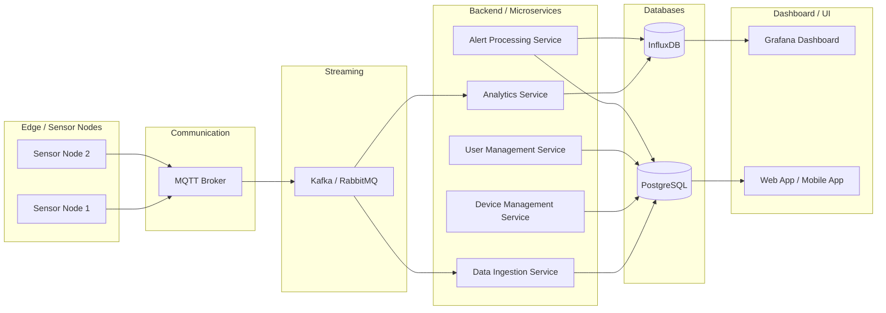

1️⃣ DEVICE

- Cada sensor físico instalado na vinha

- Contém informação da localização, status e data de instalação

- uuid garante unicidade global para integração com sensores via MQTT

2️⃣ SENSOR_READING  

- Guarda leituras individuais

- sensor_type identifica se é humidade do solo, temperatura, humidade do ar, etc.

- recorded_at para timestamp exato da leitura

- Observação: leituras de alta frequência também podem ser enviadas para InfluxDB para dashboards e análises temporais.

3️⃣ SENSOR_TYPE  

- Tabela de referência para tipos de sensores e suas unidades

- Útil para dashboards dinâmicos ou futuros sensores adicionados

4️⃣ ALERT 

- Guarda eventos importantes (ex: risco de fungos alto, solo seco)

- severity pode ser LOW / MEDIUM / HIGH

- triggered_at e resolved_at ajudam a monitorar histórico de alertas

5️⃣ USER  

- Usuários do sistema (produtores, técnicos)

- Relaciona quais DEVICEs cada usuário possui

## Arquitetura de Dados Completa — Smart Vineyard IoT  

