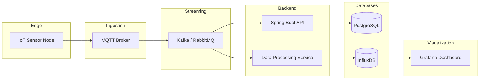

# 🍇 Smart Vineyard Monitor — IoT para Vinhas

## 1. Visão Geral

A produção vitivinícola depende fortemente das condições ambientais. Pequenas variações de temperatura, humidade e humidade do solo podem impactar a qualidade da colheita e aumentar o risco de doenças como míldio e oídio.

Este projeto explora o desenvolvimento de um **sistema IoT para monitorização de vinhas**, capaz de recolher dados ambientais em tempo real e fornecer recomendações para rega e prevenção de fungos.

O objetivo do projeto é demonstrar competências em:

* desenvolvimento de sistemas IoT
* arquitetura de software
* recolha e processamento de dados
* desenvolvimento de dashboards

---

## 2. Problema

Pequenos produtores frequentemente tomam decisões de irrigação e tratamento baseadas em:

* experiência pessoal
* observação manual do solo
* previsões meteorológicas genéricas

Isso gera problemas como:

* uso excessivo de água
* deteção tardia de doenças
* falta de dados específicos da parcela agrícola

---

## 3. Investigação (Simulada)

Foi realizada uma simulação de entrevistas com **8 produtores de vinho** de diferentes regiões vitivinícolas.

### Resultados principais

**Método de decisão de rega**

| Método               | Percentagem |
| -------------------- | ----------- |
| Experiência pessoal  | 50%         |
| Observação do solo   | 25%         |
| Dados meteorológicos | 15%         |
| Sensores             | 10%         |

**Utilização de tecnologia**

| Tecnologia            | Utilização   |
| --------------------- | ------------ |
| Sensores de solo      | 1 produtor   |
| Estação meteorológica | 2 produtores |
| Nenhuma tecnologia    | 5 produtores |

**Impacto de doenças**

* perdas médias estimadas: **5–15% da produção**
* principais doenças:

  * míldio
  * oídio

---

## 4. Problema Definido

Pequenos produtores de vinho têm dificuldade em **monitorizar as condições ambientais da vinha**, o que dificulta decisões informadas sobre:

* irrigação
* prevenção de fungos
* gestão da plantação

---

## 5. Solução Proposta

Sistema IoT composto por:

### Dispositivo IoT

Instalado na vinha para recolha de dados ambientais.

Sensores utilizados:

* humidade do solo
* temperatura do solo
* temperatura do ar
* humidade do ar

### Plataforma Cloud

Sistema backend para:

* ingestão de dados
* armazenamento
* análise

### Dashboard

Interface para o produtor visualizar:

* condições do solo
* risco de fungos
* recomendações de rega

---

## 6. Arquitetura do Sistema



---

## 7. Arquitetura do Dispositivo

Hardware proposto:

* ESP32
* sensor capacitivo de humidade do solo
* sensor ambiental BME280
* bateria
* painel solar

Fluxo de funcionamento:

1. dispositivo acorda periodicamente
2. lê sensores
3. envia dados via MQTT
4. volta a entrar em modo deep sleep

---

## 8. Processamento de Dados

Um algoritmo simples calcula o risco de fungos com base em:

* humidade do ar
* temperatura
* duração da humidade elevada

Exemplo de regra:

```
se humidade_ar > 85%
e temperatura entre 18°C e 25°C
durante mais de 6 horas

→ risco elevado de fungos
```

---

## 9. Dashboard

O dashboard apresenta:

* gráfico de humidade do solo
* temperatura
* humidade do ar
* nível de risco de fungos
* alertas de rega

Tecnologias possíveis:

* Grafana
* React
* Node.js

---

## 10. Resultados Esperados

Benefícios potenciais para produtores:

* redução do consumo de água
* deteção precoce de doenças
* melhor planeamento agrícola

---

## 11. Futuras Melhorias

* previsão de colheita
* integração com sistemas de rega automática
* machine learning para previsão de doenças
* aplicação mobile

---

## 12. Tecnologias Utilizadas

Hardware:

* ESP32
* sensores ambientais

Software:

* MQTT
* Node.js
* InfluxDB
* Grafana

---

## 13. Objetivo do Projeto

Este projeto foi desenvolvido como **prova de conceito de um sistema IoT aplicado à agricultura**, demonstrando conhecimentos em:

* arquitetura de sistemas distribuídos
* IoT
* processamento de dados
* desenvolvimento de dashboards

```
```
