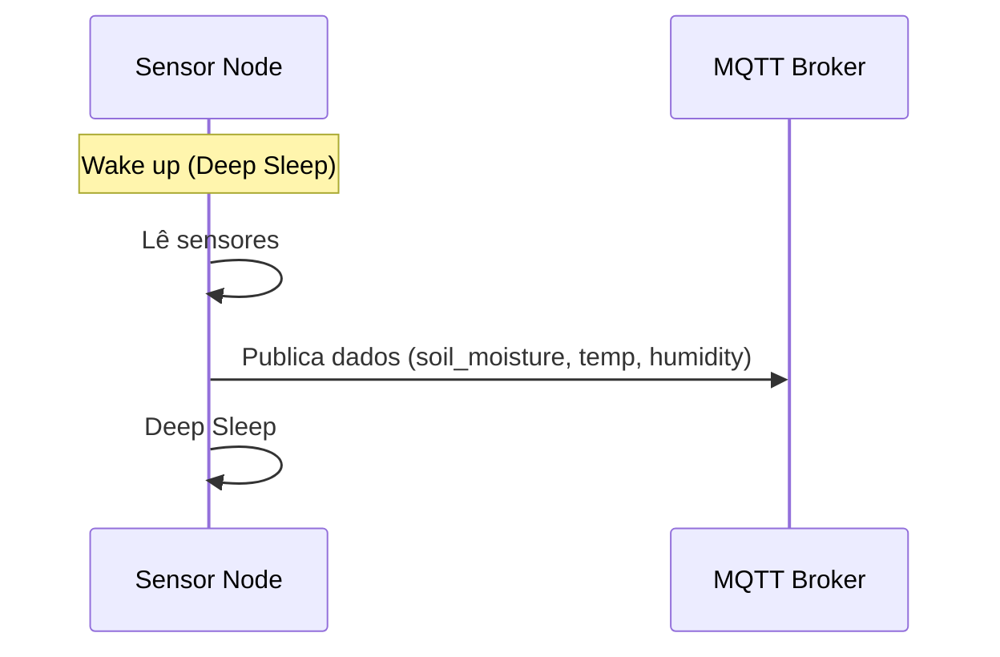

# Passo 1 — Edge / Sensor Nodes
Objetivo  
Mostrar como os sensores recolhem dados e enviam para a plataforma.
Componentes  
- ESP32 (microcontrolador)  
- Sensores:  
    - Humidade do solo (capacitivo)
    - Temperatura do solo
    - Temperatura do ar
    - Humidade do ar (BME280)
- Energia:
    - Bateria + painel solar
- Comunicação:
    - MQTT (WiFi ou LoRa)

Fluxo do Sensor Node

💡 Explicação:

O ESP32 acorda, lê os sensores e envia os dados via MQTT.

Depois volta a dormir para poupar bateria (ideal para meses de autonomia).