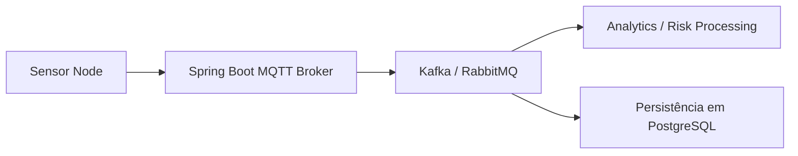

# Passo 2 — Comunicação e Broker MQTT (Spring Boot)
## Objetivo

Receber dados dos sensores, validar e publicar para processamento downstream (Kafka/RabbitMQ).

## Componentes

Spring Boot MQTT Broker Service
- Recebe mensagens MQTT dos sensores
- Valida payload (JSON)
- Publica eventos para Kafka/RabbitMQ para processamento assíncrono

Kafka / RabbitMQ
- Streaming de eventos
- Permite escalabilidade e múltiplos consumidores

Fluxo de Comunicação

💡 Explicação:

1) Sensor Node envia dados via MQTT (soil_moisture, temperature, humidity).

2) Spring Boot MQTT Broker recebe a mensagem, valida o JSON, adiciona timestamp e metadata do dispositivo.

3) Publica os eventos no Kafka/RabbitMQ para:
    - AnalyticsService → cálculo de risco de fungos e alertas
    - IngestionService → persistência de dados estruturados em PostgreSQL

Exemplo de Payload JSON enviado pelo sensor
```json
{
  "deviceId": "vineyard-sensor-01",
  "timestamp": "2026-03-15T10:30:00Z",
  "soilMoisture": 42.3,
  "airTemperature": 22.1,
  "airHumidity": 88.5
}
```

Estrutura do Spring Boot MQTT Broker
```
spring-boot-mqtt-broker
│
├─ src/main/java/com/vineyard/mqttbroker/
│   ├─ MqttConfig.java        # configuração do broker MQTT
│   ├─ MqttController.java    # recebe mensagens MQTT
│   ├─ KafkaPublisher.java    # publica eventos para Kafka
│   └─ PayloadValidator.java  # valida e enriquece dados
│
└─ pom.xml
```
Exemplo de Código Simplificado (Java 21 + Spring Boot)
```java
@MqttListener(topic = "vineyard/sensors/#")
public void receiveSensorData(String payload) {
    SensorData data = payloadValidator.validate(payload);
    kafkaPublisher.publish(data);
}
```
- @MqttListener → recebe mensagens MQTT

- payloadValidator → checa campos obrigatórios e tipo de dados

- kafkaPublisher → envia eventos para o streaming layer