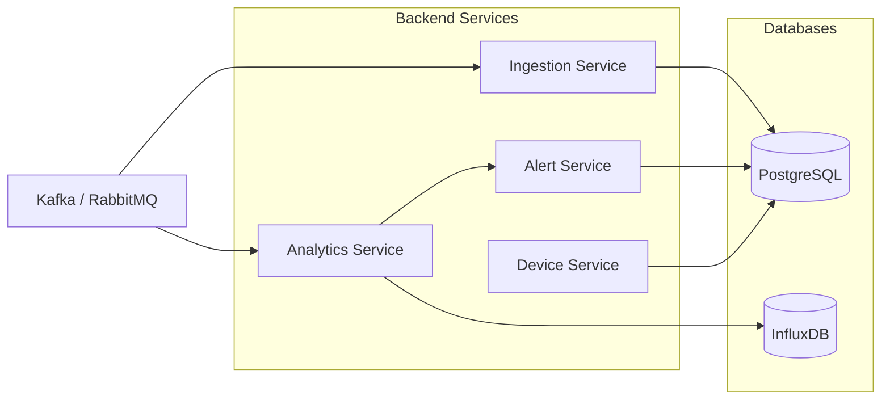
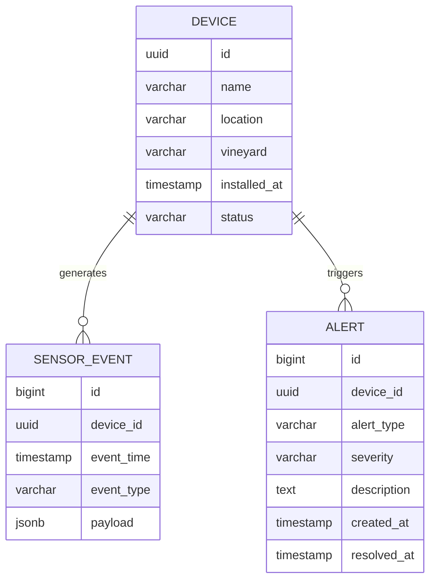

# Passo 3 — Camada Backend e Persistência de Dados
## Objetivo  
Processar os dados recebidos do streaming (Kafka/RabbitMQ) e armazená-los corretamente.

Separaremos os dados em dois tipos:  
1️⃣ Dados estruturados → PostgreSQL  
2️⃣ Séries temporais → InfluxDB

Isso é uma arquitetura muito comum em plataformas IoT reais.

## Arquitetura da Camada Backend  

## Responsabilidade de Cada Serviço  
1️⃣ Ingestion Service

Função:  
- consumir eventos do Kafka  
- validar dados  
- armazenar metadados no PostgreSQL

Exemplos de dados guardados:
- dispositivo
- localização  
- última atividade  
- status do sensor

2️⃣ Analytics Service

Função:  
- processar dados do sensor  
- guardar séries temporais no InfluxDB  
- calcular risco de fungos  
- gerar eventos de alerta

3️⃣ Alert Service

Função:  
- registar alertas  
- enviar notificações
- permitir visualização no dashboard

Modelo de Dados PostgreSQL

Tabelas principais:

## Estrutura da Base de Dados

DEVICE

informação sobre sensores
```sql
CREATE TABLE device (
    id UUID PRIMARY KEY,
    name TEXT,
    location TEXT,
    vineyard TEXT,
    installed_at TIMESTAMP,
    status TEXT
);
```
SENSOR_EVENT

eventos recebidos do sensor
```sql
CREATE TABLE sensor_event (
    id BIGSERIAL PRIMARY KEY,
    device_id UUID REFERENCES device(id),
    event_time TIMESTAMP,
    event_type TEXT,
    payload JSONB
);
```
ALERT

alertas gerados pelo sistema
```sql
CREATE TABLE alert (
    id BIGSERIAL PRIMARY KEY,
    device_id UUID REFERENCES device(id),
    alert_type TEXT,
    severity TEXT,
    description TEXT,
    created_at TIMESTAMP,
    resolved_at TIMESTAMP
);
```
## Dados em InfluxDB

O InfluxDB armazenará leituras contínuas dos sensores.

Exemplo de measurement:
```
measurement: vineyard_sensors
```
tags:
```
device_id
vineyard
sensor_type
```
fields:
```
soil_moisture
air_temperature
air_humidity
```
exemplo de linha:
```
vineyard_sensors,device_id=sensor01 vineyard="douro" soil_moisture=42.1,air_temperature=22.3,air_humidity=85.2 1710000000
```
## Processamento de Risco de Fungos

O Analytics Service pode aplicar regras simples:
```
if air_humidity > 85
and air_temperature between 18 and 25
for more than 6 hours

→ risk = HIGH
```
Quando isto acontece:

1️⃣ gera evento
2️⃣ grava alerta no PostgreSQL
3️⃣ Grafana pode mostrar alerta

## Estrutura dos Microserviços
backend
```
device-service
ingestion-service
analytics-service
alert-service
api-gateway
```
todos com
```
Spring Boot
Java 21
Kafka consumer
Docker
```
