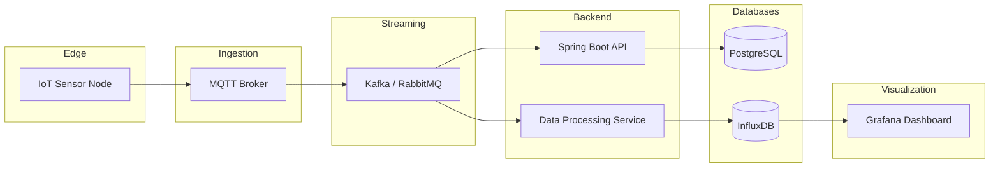
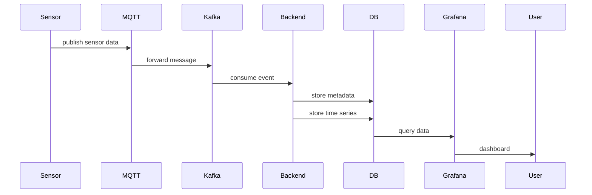
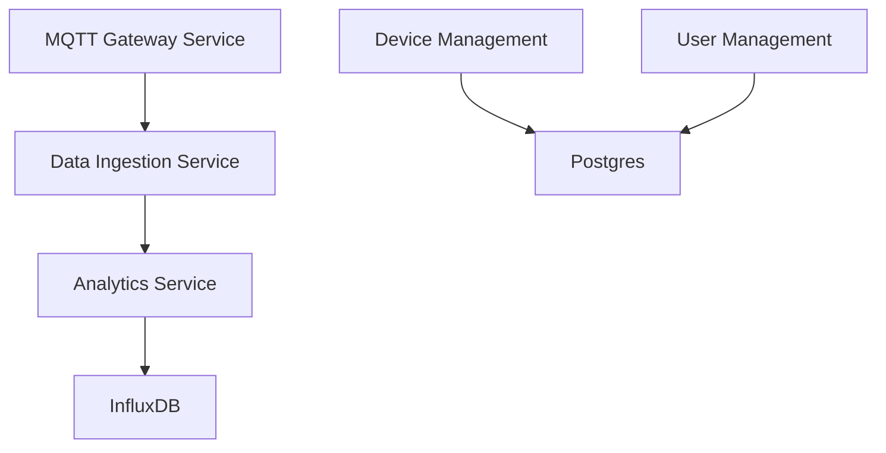
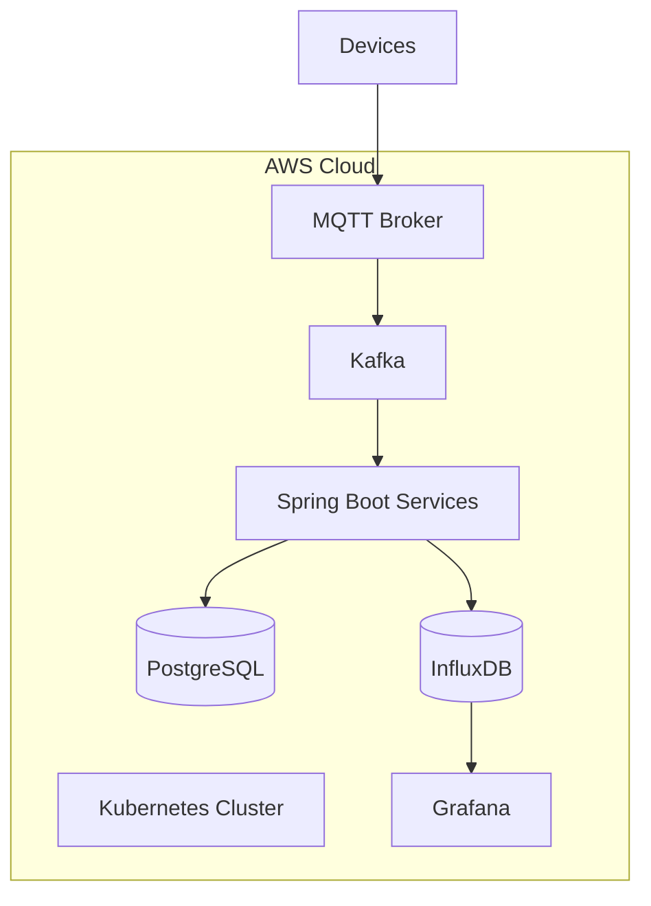
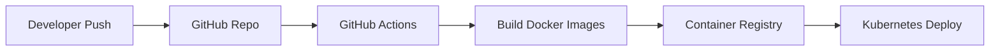

# Arquitetura Geral do Sistema

# 2️⃣ Fluxo de Dados

Fluxo completo desde o sensor até ao dashboard.

### Explicação do Fluxo de Dados

1) Sensor Nodes (ESP32 + Sensores)  
    - Cada dispositivo envia dados via MQTT (humidade, temperatura, etc.)

2) MQTT Broker  
    - Recebe dados em tempo real dos sensores  
    - Encaminha para Kafka para processamento escalável

3) Kafka / RabbitMQ (Streaming Layer)  
    - Garantia de entrega e desacoplamento
    - Permite processamento em tempo real e consumo por múltiplos serviços

4) Backend Microservices (Spring Boot, Java 21)  
    - Ingestion Service: valida e persiste dados em PostgreSQL
    - Analytics Service: calcula risco de fungos, recomenda rega, escreve séries temporais em InfluxDB
    - Alert Service: gera alertas de acordo com thresholds
    - Device & User Services: gestão de dispositivos e utilizadores

5) Databases
    - PostgreSQL: dados estruturados (dispositivos, alertas, usuários)
    - InfluxDB: séries temporais de leituras de sensores, usadas para dashboards

6) Visualização
    - Grafana: visualização de séries temporais e alertas
    - Web/Mobile App: interface para gestão de dispositivos e alertas

# 3️⃣ Microserviços Backend

A arquitetura backend pode ser dividida em serviços.

# 4️⃣ Estrutura do Repositório

Uma estrutura que fica muito bem no GitHub.
```
smart-vineyard-iot

device-simulator/
    sensor-simulator

backend/

    api-service/
    ingestion-service/
    analytics-service
    device-service

infrastructure/

    docker/
    kubernetes/
    terraform

dashboard/

    grafana-dashboards

docs/

    architecture
    diagrams
```
# 5️⃣ Infraestrutura

Arquitetura cloud usando containers.

6️⃣ Pipeline CI/CD

Com GitHub Actions.

# 7️⃣ Exemplo de Evento IoT

Mensagem enviada pelo sensor:
```
{
  "deviceId": "vineyard-sensor-01",
  "timestamp": "2026-03-15T10:30:00Z",
  "soilMoisture": 42.3,
  "airTemperature": 22.1,
  "airHumidity": 88.5
}
```
8️⃣ Processamento de Dados

O serviço analytics-service pode calcular:

risco de fungos

recomendação de rega

alertas

Exemplo de regra:
```
if humidity > 85
and temperature between 18 and 25
then risk = HIGH
```
# 9️⃣ Simulador de Sensores

Como isto é portfólio, podes criar um sensor simulator em Java.

Ele envia dados simulados via MQTT.
```
while(true) {

   SensorData data = new SensorData(
       randomSoilMoisture(),
       randomTemperature(),
       randomHumidity()
   );

   mqttClient.publish("vineyard/sensor", data);

   Thread.sleep(30000);
}
```

Isso permite:

demonstrar pipeline completo

gerar dados para Grafana

# 🔟 Dashboard Grafana

Exemplos de painéis:

- Humidade do solo

- Temperatura

- Humidade do ar

- Risco de fungos

- Histórico de sensores

# 1️⃣1️⃣ O que este projeto demonstra

Este projeto mostra competências em:

Backend

- Spring Boot

- Java 21

- Event-driven architecture

Streaming

- Kafka / RabbitMQ

- MQTT

Data

- PostgreSQL

- InfluxDB

DevOps

- Docker

- Kubernetes

- GitHub Actions

- Terraform

- AWS

💡 Dica MUITO importante para portfólio

Adiciona 3 coisas que impressionam recrutadores:

1️⃣ sensor simulator

gera dados realistas

2️⃣ dashboards reais

screenshots do Grafana

3️⃣ arquitetura bem documentada

diagramas como estes