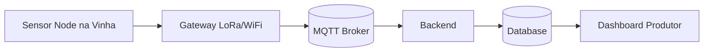
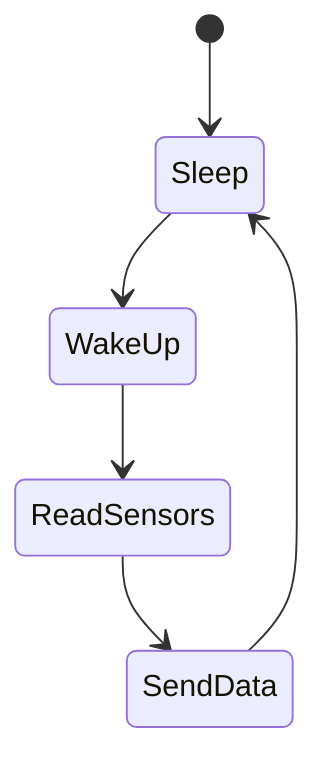

# IOT Vinhas

## Fase 1 — Descoberta do Problema (2–4 semanas)
Objetivo: validar que o problema vale a pena resolver.

Tarefas:  
- entrevistar 5–10 produtores  
- perceber como fazem atualmente:  
    - controlo de humidade  
    - rega  
    - prevenção de fungos
- identificar:  
    - quanto perdem por fungos  
    - quanto gastam em água  
    - se usam sensores atualmente

Perguntas importantes:
- Como decide quando regar?
- Já teve perdas por míldio ou oídio?
- Usa estação meteorológica?

Resultado esperado:
- ✔ lista clara de problemas prioritários

## Fase 2 — Definição do MVP (Produto mínimo)

Primeira versão do produto.

Sensores incluídos
- humidade do solo

- temperatura do solo

- temperatura do ar

- humidade do ar

Hardware

- ESP32

- sensor capacitivo de solo

- sensor BME280 (clima)

- bateria + painel solar

Comunicação

- Wi-Fi ou LoRa

Arquitetura MVP




## Fase 3 — Firmware do Sensor

Funções principais do firmware:

- ler sensores

- enviar dados

- poupar bateria
fluxograma:


acorda a cada 30 minutos

envia dados

volta a dormir

Bateria pode durar 6–12 meses.

## Fase 4 — Plataforma Cloud
Tecnologia simples no início.  
backend:  
- spring boot
- mqtt
- kafka/rabbitmq
- java 21

base dados:
- postgressql

dashboard:
- grafana
- influxdb

docker,kubernetes,githubactions,aws

## Fase 5 — Algoritmo de risco de fungos

Problemas comuns nas vinhas:

- míldio

- oídio

Eles dependem muito de:

- humidade alta

- temperatura específica

- duração da humidade

Modelo simples inicial:
```
Se humidade > 85%
E temperatura entre 18–25°C
Durante > 6h

→ risco alto de fungos
```

Dashboard pode mostrar:

🟢 baixo
🟡 médio
🔴 alto risco

## Fase 6 — Dashboard para o produtor

Interface simples.

Informação útil:

sensores

- humidade do solo

- temperatura do solo

- humidade do ar

alertas

- risco de fungos

- solo seco

- temperatura extrema

/home/guilherme/repos/consumeApp/MonitorSolos/docs/layoutDasboard.png


## Fase 7 — Piloto com produtores

Testar com:

- 2–3 vinhas

- 10 sensores

Duração ideal:

1 estação agrícola

Objetivo:

- validar sensores

- validar alertas

- recolher feedback


## Fase 8 — Produto comercial

Depois do piloto:

Melhorias:

- caixa IP65

- PCB própria

- app mobile

- OTA firmware updates

💰 Modelo de negócio
Hardware

sensor → 120€–200€

Software

plataforma → 8€–15€/mês por sensor

🚀 Expansão futura

Depois do MVP podes adicionar:

previsão de colheita

usando:

- temperatura acumulada

- crescimento da planta

deteção de stress hídrico  
integração com rega automática

## 📈 Escala futura

Se funcionar bem em vinhas podes expandir para:

olivais

amendoais

estufas

agricultura intensiva

💡 Ideia muito forte (startup level)

Em vez de vender só sensores:

criar uma plataforma de gestão agrícola baseada em dados.

Os sensores tornam-se apenas a porta de entrada.